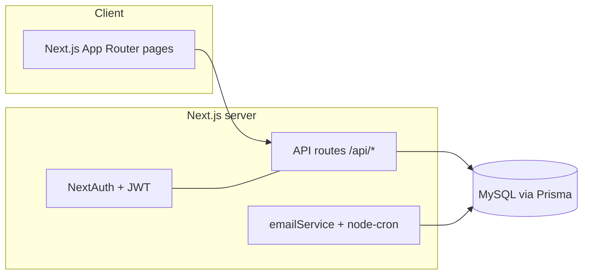

# CLAUDE.md

Guidance for AI agents (Claude Code) working in this repository. Read this first.

## What this project is

**Internship CRM** — a Next.js app for managing mentor ↔ mentee relationships through an
internship/hiring pipeline. It digitizes a workflow previously tracked in a spreadsheet:
mentors follow each mentee from first contact → internship → hired, logging interactions
along the way.

## Tech stack

- **Next.js 15** (App Router) + **React 19** + **TypeScript**
- **Prisma 5** ORM → **MySQL**
- **NextAuth 4** (Credentials provider, JWT sessions, bcrypt password hashing)
- **Tailwind CSS**, **lucide-react**, **react-hook-form**, **zod**
- **Nodemailer** (SMTP) + **node-cron** for interaction reminders
- Containerized (**Docker**); deployed to a **Plesk** server via GitHub Actions

## Commands

```bash
npm run dev          # local dev server (http://localhost:3000)
npm run build        # production build
npm run start        # serve production build
npm run lint         # next lint
npx prisma generate  # regenerate client (also runs on postinstall)
npx prisma db push   # sync schema to DB (this project uses db push, NOT migrations)
npx prisma db seed   # create first ADMIN (see seed env vars below)

npm run test:e2e         # Playwright smoke tests (starts the app itself)
npm run test:e2e:headed  # same, with a visible browser
```

**E2E tests** (Playwright) live in `e2e/` and run as a CI quality gate on every PR
(`.github/workflows/e2e.yml`, isolated MySQL service). Locally `test:e2e` boots the dev
server; set `BASE_URL=https://crm-preview.ersah.in` to run against a deployed env instead.
After switching branches, run `npx prisma generate` so the client matches the schema —
a stale client causes schema-drift 500s (the smoke test will catch these).

## Architecture



### Roles & landing pages
- `ADMIN` → `/admin` (invite users, browse candidates, assign mentorships, companies)
- `MENTOR` → `/mentor` (own mentees, interaction logs)
- `MENTEE` → `/portal` (own profile, assigned mentor/company)

### Data model (Prisma) — key models
- **User** (`role`: ADMIN | MENTOR | MENTEE) — profile fields, `skills` (JSON)
- **MentorshipRelation** (mentor ↔ mentee, optional company) — `status` (ACTIVE|COMPLETED)
  and `pipelineStatus` (granular stage, see below)
- **InteractionLog** (Meeting | Feedback | Email) per relation
- **Company** + **CompanyNeed**
- **InvitationToken** (email-based registration, 7-day expiry)

### Pipeline status (the core domain concept)
`MentorshipRelation.pipelineStatus` mirrors the original spreadsheet's status column.
Stages (enum `PipelineStatus`): `BASVURU_100` → `ONAY_220` → `GORUSME_250` →
`TANISTIRMA_270` → `STAJ_BASLAYACAK_300` → `STAJ_DEVAM_450` → `STAJ_BITTI_490` →
`IS_ARIYOR_500` → `ISE_ALINABILIR_600` → `ISE_ALINDI_660` → `IS_BULDU_700`
(plus `YARIM_BIRAKTI_460`, `BASKA_YERDE_STAJ_800`). Default `BASVURU_100`.

## Directory map

```
src/
  app/
    api/            # route handlers (auth, register, invite, mentorship, interactions, ...)
    admin/  mentor/  portal/  auth/  onboarding/   # role-scoped pages
    layout.tsx  page.tsx  icon.svg
  components/ui/    # Button, Card, Input, Select, Badge, ...
  components/forms/ # OnboardingForm, ...
  lib/              # auth.ts (NextAuth config), prisma.ts (client singleton)
  services/         # emailService.ts (SMTP + cron reminders)
prisma/
  schema.prisma     # source of truth for the DB
  seed.mjs          # first-admin seeder
.github/workflows/deploy.yml  # build → ghcr.io → SSH deploy (prod + PR previews)
```

## Environment variables

See `.env.example`. Required: `DATABASE_URL` (MySQL), `NEXTAUTH_URL`, `NEXTAUTH_SECRET`.
SMTP_* for email. Seeder: `SEED_ADMIN_EMAIL` / `SEED_ADMIN_PASSWORD` / `SEED_ADMIN_NAME`.

## Deployment

`.github/workflows/deploy.yml` runs on push to `main` (production) and on PRs (preview):
1. Build Docker image, push to `ghcr.io`.
2. SSH to the Plesk server, `docker run` the image, `prisma db push --accept-data-loss`.

| Env | Container | Port | URL |
|-----|-----------|------|-----|
| Production | `internship-crm` | 3200 | https://crm.ersah.in |
| Preview (PRs) | `internship-crm-preview` | 3201 | https://crm-preview.ersah.in |

⚠️ **All open PRs share one preview container** (tracked in issue #39).
⚠️ The preview DB is **shared** — `prisma db push` there affects everyone's preview.

## Conventions & gotchas for agents

- **Schema first**: change `prisma/schema.prisma`, run `prisma format && prisma validate &&
  prisma generate`. This project uses **`db push`**, there is **no `migrations/` folder** — do
  not author SQL migrations.
- **Do not run `db push` against the shared preview/prod DB** without explicit confirmation;
  CI handles DB sync on deploy.
- **Never commit secrets.** Real values live only in server-side env / GitHub secrets.
- **Branch + PR per change.** Branch names: `feat/<issue>-slug`, `fix/<issue>-slug`,
  `docs/...`. Reference issues with `Closes #N`. Merging to `main` deploys to production —
  leave merges to a human unless told otherwise.
- **Work is tracked on a GitHub Project board** (Epics #5–#11, stories #12+). Move the issue
  to the matching column as you work.
- Co-author trailer on commits: `Co-Authored-By: Claude Opus 4.8 <noreply@anthropic.com>`.
