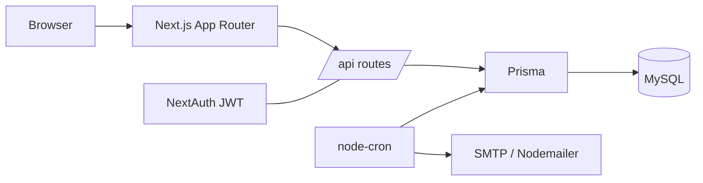
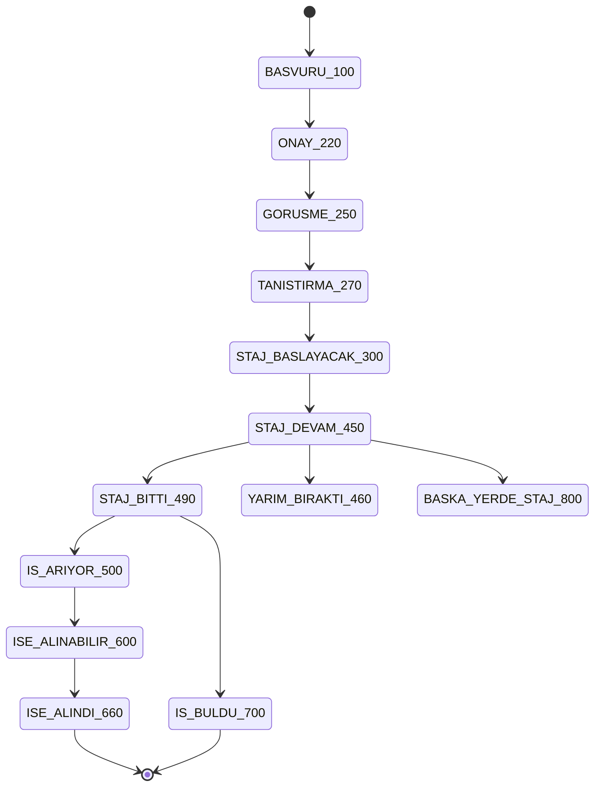

# Internship CRM

Mentor ↔ Mentee CRM & internship management system. Tracks each mentee through a hiring
pipeline (first contact → internship → hired), with interaction logging, role-based
dashboards, and email reminders. Built to replace a spreadsheet-based mentoring workflow.

## Features

- **Role-based access** — Admin, Mentor, Mentee, each with its own dashboard.
- **Mentorship pipeline** — granular status per mentee (`BASVURU_100` … `IS_BULDU_700`).
- **Interaction logs** — meetings / feedback / emails per mentorship.
- **Candidate browsing & matching** — search/filter mentees, assign mentors & companies.
- **Invitation-based registration** — email tokens with role assignment.
- **Email reminders** — cron nudges mentors with stale (14-day) mentees.

## Tech stack

Next.js 15 (App Router) · React 19 · TypeScript · Prisma 5 · MySQL · NextAuth 4 ·
Tailwind CSS · Nodemailer · Docker.

## Architecture



## Pipeline stages



## Local setup

```bash
# 1. Install
npm install

# 2. Configure env
cp .env.example .env        # then fill DATABASE_URL, NEXTAUTH_SECRET, etc.

# 3. Sync DB schema (this project uses db push, not migrations)
npx prisma db push

# 4. Create the first admin
npx prisma db seed          # uses SEED_ADMIN_* env (default admin@example.com / ChangeMe123!)

# 5. Run
npm run dev                 # http://localhost:3000
```

### Required environment variables

| Variable | Purpose |
|----------|---------|
| `DATABASE_URL` | MySQL connection string |
| `NEXTAUTH_URL` | App base URL |
| `NEXTAUTH_SECRET` | NextAuth signing secret |
| `SMTP_HOST` / `SMTP_PORT` / `SMTP_USER` / `SMTP_PASS` / `SMTP_FROM` | Email (invites, reminders) |
| `SEED_ADMIN_EMAIL` / `SEED_ADMIN_PASSWORD` / `SEED_ADMIN_NAME` | First admin (seed, optional) |

See [`.env.example`](.env.example) for the full list.

## Scripts

| Command | Description |
|---------|-------------|
| `npm run dev` | Dev server |
| `npm run build` | Production build |
| `npm run start` | Serve production build |
| `npm run lint` | Lint (`next lint`) |
| `npm run test:e2e` | Playwright smoke tests (add `:headed` to watch) |
| `npx prisma db push` | Sync schema to DB |
| `npx prisma db seed` | Seed first admin |

## Testing

End-to-end smoke tests live in [`e2e/`](e2e/) (Playwright). They cover the home page,
sign-in, admin login, and that the admin pages render without server errors.

```bash
npm run test:e2e            # starts the app and runs headless
npm run test:e2e:headed     # visible browser
BASE_URL=https://crm-preview.ersah.in npm run test:e2e   # against a deployed env
```

CI runs these on every PR ([`.github/workflows/e2e.yml`](.github/workflows/e2e.yml)) against
an isolated MySQL service, so a regression fails the check before merge.

## Deployment

CI/CD via GitHub Actions ([`.github/workflows/deploy.yml`](.github/workflows/deploy.yml)):
push to `main` deploys **production**; every PR deploys a **preview**.

| Environment | URL | Trigger |
|-------------|-----|---------|
| Production | https://crm.ersah.in | push to `main` |
| Preview | https://crm-preview.ersah.in | pull requests |

The pipeline builds a Docker image, pushes it to GitHub Container Registry, then SSHes to the
Plesk host to run the container and apply the schema with `prisma db push`.

## Project structure

```
src/app/        # App Router pages + /api routes (admin, mentor, portal, auth, onboarding)
src/components/ # UI primitives + forms
src/lib/        # auth + prisma client
src/services/   # email + cron
prisma/         # schema.prisma + seed
```

## Contributing

Work is planned on a GitHub Project board as Epics (#5–#11) and Stories (#12+). Branch per
issue (`feat/<issue>-slug`), open a PR, reference `Closes #N`. For AI-agent guidance see
[CLAUDE.md](CLAUDE.md).
